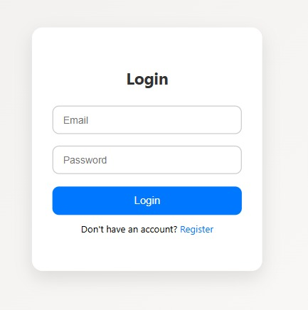
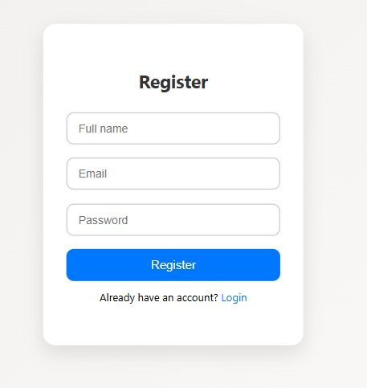
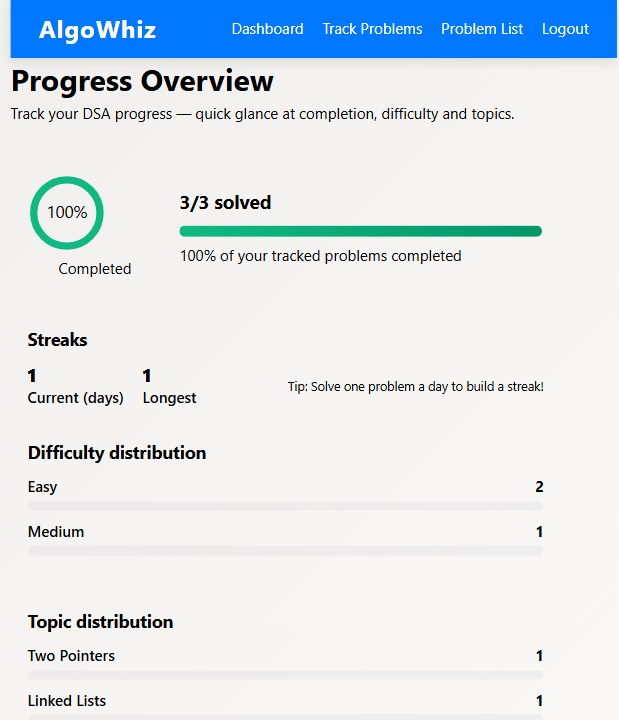
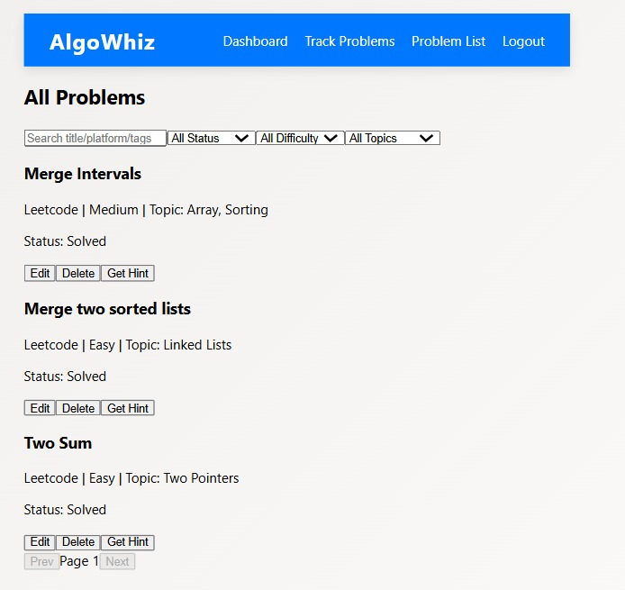
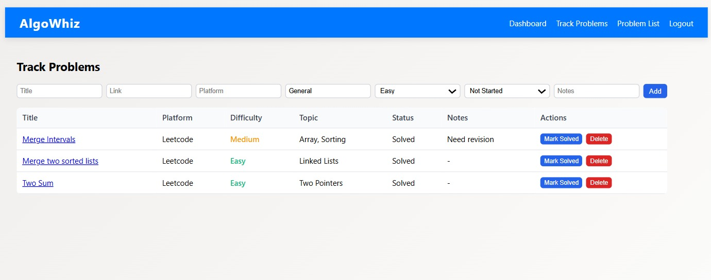

# AlgoWhiz

Algo Whiz is a *problem tracking web application* built with the MERN stack. It helps users register, log in, track DSA problems progress, and even get AI-powered hints for problems using OpenAI.  

---

## Features  
- *User Authentication* – Register/Login using JWT authentication  
- *Problem List* – Add, update, and view coding problems  
- *Track Progress* – Mark problems as solved, unsolved, in-progress  
- *AI Hints* – Integrated with OpenAI to generate problem-solving hints  
- *Responsive UI* – Dashboard and tracking system  

---

## Tech Stack  
*Frontend:* React.js, React Router, Axios, CSS  
*Backend:* Node.js, Express.js  
*Database:* MongoDB (Atlas)  
*AI Integration:* OpenAI API  

---
## Screenshots

### Login Page

### Register Page

### Dashboard

### 📑 Problem List

### Track Problems

